# netrun-cad-web Architecture

Browser-native CAD for landscape design (with Apple Pencil on iPad) AND the Survai construction-mode 3D-scan annotator. Same build, dual hostname routing: `cad.netrunsystems.com` and `survai.netrunsystems.com`. Standalone Vite + React SPA — explicitly NOT a Sigil plugin (canvas drawing model doesn't fit admin CRUD shape).

> **Verified May 2026**: `cad.netrunsystems.com` returns 200. v1 backlog closed May 11, 2026. Active priority — netrun-cad is an internal revenue SKU; Allie's landscape work depends on it shipping for real paid jobs.

## System

```mermaid
flowchart TB
  subgraph iPad["iPad / Pencil (target device)"]
    PENCIL["Apple Pencil<br/>pressure · tilt · 600ms long-press"]
    TOUCH["Two-finger gestures<br/>pinch-zoom · pan"]
  end

  subgraph Browser["Browser SPA"]
    direction TB
    APP["App.tsx — root"]
    MODE["Mode switcher: CAD / Draw / Color / Text"]
    CMD["CommandLine.tsx<br/>(88 AutoCAD-LT aliases)"]

    subgraph Canvas["components/Canvas/"]
      CADC["CADCanvas.tsx<br/>(orchestrates all state)"]
      PE["usePointerEvents.ts<br/>(mouse + touch + Pencil unified)"]
      CTOOL["useCADTools.ts<br/>(line · rect · circle · dim)"]
      DTOOL["useDrawingTools.ts<br/>(perfect-freehand)"]
      COLTL["useColorTools.ts<br/>(watercolor · marker)"]
      LAYERS["useLayers.ts"]
      GRID["useGrid.ts (snap)"]
      ZOOM["useZoomPan.ts"]
      RENDER["renderer.ts<br/>(Canvas 2D)"]
    end

    subgraph Panels["Panels"]
      MT["ModeToolbar"]
      PT["PlantBrowser<br/>(40 SoCal plants · WUCOLS)"]
      BM["BasemapPanel<br/>(Esri satellite + Nominatim)"]
      PROJ["ProjectBar (Drive)"]
      LP["LayerPanel"]
      HP["HelpPanel"]
    end

    subgraph Engine["engine/"]
      CMDREG["commands.ts<br/>88 AutoCAD aliases<br/>+ landscape extensions"]
      GEO["geometry.ts<br/>(distance · snap · intersect)"]
      HIST["history.ts<br/>(undo/redo)"]
      DXFIN["dxf-import.ts"]
      DXFOUT["dxf-export.ts (R12)"]
      PDF["pdf-export.ts<br/>ARCH D/E · scale presets"]
      GEO_IN["geojson-import.ts · kml-import.ts"]
      OBJ["obj-import.ts (Web Worker)"]
      PLY["ply-import.ts (Web Worker)"]
      SCAN["scan-processor.ts<br/>(convex hull + contours)"]
      SYM["symbol-loader.ts<br/>(40 plant symbols)"]
    end

    subgraph Survai["Survai mode (hostname-based)"]
      DET["MEP detection viewer<br/>(survai.netrunsystems.com)"]
      IRRIG["Irrigation overlay<br/>(4 head types · 8 zones · GPM)"]
    end
  end

  subgraph Storage["Persistence"]
    LS["localStorage<br/>(5s auto-save)"]
    DRIVE["Google Drive API<br/>(.ncad project files)"]
  end

  subgraph External["External services"]
    ESRI["Esri World Imagery tiles"]
    OSM["Nominatim geocoding"]
    KIRI["KIRI Engine<br/>(OBJ/PLY mesh from scan)"]
    YOLO["Survai pipeline<br/>YOLOv8 + PointNet++<br/>→ MEP detection JSON"]
  end

  PENCIL --> PE
  TOUCH --> CADC
  PE --> CADC
  CADC --> MODE
  CADC --> CTOOL
  CADC --> DTOOL
  CADC --> COLTL
  CADC --> RENDER
  CADC --> LAYERS
  CADC --> GRID
  CADC --> ZOOM

  CMD --> CMDREG
  CMDREG --> CTOOL

  CTOOL --> GEO
  CTOOL --> HIST

  PT --> SYM
  SYM --> RENDER
  BM --> ESRI
  BM --> OSM

  CADC --> DXFIN
  CADC --> DXFOUT
  CADC --> PDF
  CADC --> GEO_IN
  CADC --> OBJ
  CADC --> PLY
  OBJ --> SCAN
  PLY --> SCAN
  SCAN --> RENDER

  KIRI -. OBJ/PLY .-> OBJ
  YOLO -. detection JSON .-> DET
  DET --> Survai
  IRRIG --> Survai

  CADC --> LS
  PROJ --> DRIVE

  APP --> MODE
  APP --> Canvas
  APP --> Panels
  APP --> Engine
```



## Four modes (verified per README)

1. **CAD mode** — precise measurements, snap-to-grid, layers, keyboard command aliases (AutoCAD LT-compatible). Tools: line / rect / circle / polyline / arc / ellipse / spline / dimension.
2. **Draw mode** — Apple Pencil freehand sketching using `perfect-freehand` (Tldraw's pressure-sensitive stroke library).
3. **Color mode** — watercolor/marker brushes for hand-colored plans (pressure = opacity).
4. **Text mode** — fine-tip pen for architect-style lettering.

## Engine capabilities (v1 shipped, verified `src/engine/`)

- 88 AutoCAD aliases in `commands.ts` plus Netrun landscape extensions
- DXF R12 import (LINE, LWPOLYLINE, CIRCLE, ARC, SPLINE, TEXT, MTEXT, INSERT) and export
- PDF export with scale options (1/4"=1', 1/8"=1', 1"=10', 1"=20', custom) and ARCH D/E/Letter/Legal/A1/A0
- GeoJSON / KML / KMZ import (coordinate projection to canvas units)
- KIRI 3D scan import (OBJ, PLY) with top-down orthographic projection, convex hull boundary, elevation contours, auto-decimation >500k points — parsing in Web Worker (off-thread)
- 5 dimension styles: linear, aligned, angular, radius, diameter
- Multi-select with union bbox resize, arrow-nudge, corner-handle resize
- Block library (8 built-in + user-defined custom, syncs via Drive)
- Irrigation overlay (4 head types, 8 zones, GPM schedule with capacity warnings) — Survai-mode primary
- Plant schedule auto-generation (CSV + PDF with WUCOLS verdict)
- 3D viewer (Three.js + drei + fiber, lazy-loaded)
- Crossing-window marquee variant (right-to-left = include intersecting)

## Input handling

PointerEvent API (unifies mouse, touch, Apple Pencil):
- `event.pressure` (0-1)
- `event.tiltX / tiltY` for shading
- `getCoalescedEvents()` for high-frequency stroke sampling
- `touch-action: none` prevents browser gesture interference
- Long-press 600ms (touch only) emulates right-click for iPad context menu
- Two-finger gestures handled separately in CADCanvas (pinch-zoom, two-finger pan)

## Project file format (.ncad)

```json
{
  "version": 1,
  "name": "project name",
  "elements": [...],
  "layers": [...],
  "view": { "offsetX": 0, "offsetY": 0, "zoom": 1 },
  "basemap": { "enabled": false, "lat": 0, "lng": 0, "zoom": 15, "provider": "esri-satellite" }
}
```

Google Drive integration: save / open / share / auto-save every 5 minutes when signed in. Generates view-only share links.

## Plant database

`src/data/plants.ts` — Southern California / Ojai-adapted plants with WUCOLS IV water ratings. Per-plant fields: common/botanical names, type, water use (VL/L/M/H), sun exposure, USDA zones, mature dimensions, deer/fire-resistant flags, CA-native flag, canopy color for plan-view rendering.

## Dual-mode deployment

Same build serves both deployments via hostname routing in `App.tsx`:
- `cad.netrunsystems.com` — landscape design mode (Allie's workflow)
- `survai.netrunsystems.com` — construction MEP-detection annotation mode (Survai pipeline frontend)

## Deployment

- Production: `cad.netrunsystems.com` (200 verified 2026-05-19)
- Platform: Google Cloud Run (`gen-lang-client-0047375361`, `us-central1`)
- Registry: `us-central1-docker.pkg.dev/gen-lang-client-0047375361/charlotte-artifacts`
- CI/CD: Cloud Build on push to main
- No backend — fully client-side SPA except for Google Drive API and external tile/scan/geocoding services

## v2 backlog (TODO.md, NOT in this build)

Multi-user collaboration (WebSocket/CRDT), Express backend with `@netrun/auth-client` full auth, DXF SPLINE + BLOCK/INSERT entities, per-emitter irrigation controllers + ETo-based water budget, live team-shared block library, multi-rotate (multi-resize works), IFC parsing in Web Worker, plotter direct-print over LAN, title-block templates for PDF, IrrigationPro/Hunter/Rain Bird controller export.
